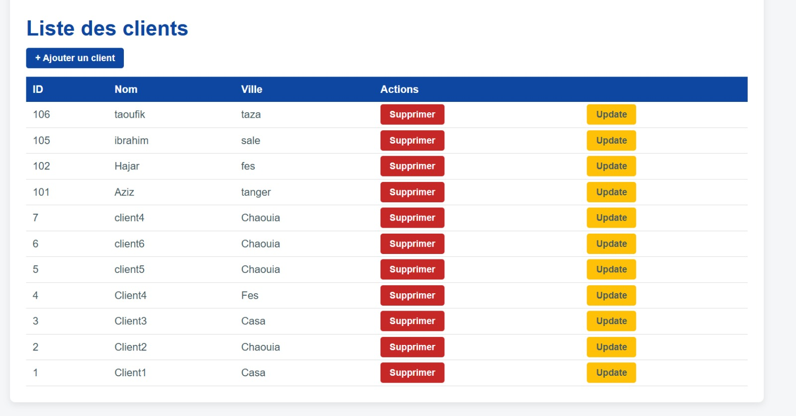
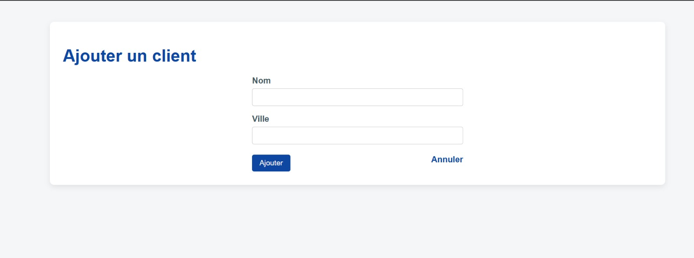

#  Client Management System (JSP / Servlet / MVC)

A Java Web Application built using **JSP, Servlets, JDBC, and MVC architecture** to manage clients (Create, Read, Update, Delete).

This project was developed as part of a J2EE practical assignment and deployed using Apache Tomcat 10 with a MySQL/MariaDB database via XAMPP.

---

## Features

- ✅ List all clients
- ✅ Add new client
- ✅ Update existing client
- ✅ Delete client
- ✅ Server-side validation (HTTP 400 for invalid input)
- ✅ MVC Architecture
- ✅ JDBC with PreparedStatement
- ✅ Custom CSS styling

---

## Architecture (MVC Pattern)

The application follows the Model–View–Controller architecture:

```
        ┌──────────────┐
        │   Browser    │
        └──────┬───────┘
               │ HTTP Request
               ▼
        ┌──────────────┐
        │ ClientServlet│  (Controller)
        └──────┬───────┘
               │
       ┌───────┴────────┐
       ▼                ▼
┌─────────────┐   ┌─────────────┐
│  ClientDAO  │   │ JSP Pages   │
│  (Model DB) │   │ (View)      │
└──────┬──────┘   └─────────────┘
       │
       ▼
   MariaDB (XAMPP)
```

---

##  Tech Stack

- Java 24 (JDK 24.0.2)
- Apache Tomcat 10
- JSP & Servlet (Jakarta EE)
- JDBC
- MySQL / MariaDB (via XAMPP)
- NetBeans IDE

---

##  Database Setup (XAMPP)

This project uses **XAMPP (MariaDB)**.

### Step 1 – Start XAMPP

1. Open XAMPP Control Panel
2. Start:
   - ✅ Apache
   - ✅ MySQL

---

### Step 2 – Create Database

1. Click **Admin** next to MySQL
2. phpMyAdmin will open
3. Create a database named:

```
magasin
```

---

### Step 3 – Execute SQL Script

```sql
CREATE DATABASE magasin;
USE magasin;

CREATE TABLE client (
  idClt INT NOT NULL AUTO_INCREMENT,
  nomClt VARCHAR(30) NOT NULL,
  villeClt VARCHAR(30) NOT NULL,
  PRIMARY KEY (idClt)
);

INSERT INTO client (nomClt, villeClt) VALUES
('Client1', 'Casa'),
('Client2', 'Settat'),
('Client3', 'Casa'),
('Client4', 'Fes');
```

---

##  Database Configuration (Important)

In `DBUtil.java`, verify the connection settings:

```java
private static final String URL = "jdbc:mysql://localhost:3306/magasin";
private static final String USER = "root";
private static final String PASS = "";
```

Default XAMPP configuration:
- Username: `root`
- Password: *(empty)*

---

## 📂 Project Structure

```
gestionClients/
│
├── Web Pages/
│   ├── client-list.jsp
│   ├── client-form.jsp
│   ├── form-update.jsp
│   └── css/
│
├── Source Packages/
│   ├── controllers/
│   │   └── ClientServlet.java
│   │
│   ├── dao/
│   │   └── ClientDAO.java
│   │
│   └── model/
│       ├── Client.java
│       └── DBUtil.java
```

---

## How to Run the Project

### 1️⃣ Clone the Repository

```bash
git clone https://github.com/abdessamad-erramy/gestionClients.git
```

---

### 2️⃣ Open in NetBeans

- Open NetBeans
- Click **Open Project**
- Select the cloned folder

---

### 3️⃣ Add MySQL JDBC Driver

- Download MySQL Connector/J
- Go to:
  ```
  Project Properties → Libraries → Add JAR
  ```
- Add the connector file

---

### 4️⃣ Deploy on Tomcat 10

- Add Apache Tomcat 10 server in NetBeans
- Right-click project → Run
- Open browser:

```
http://localhost:8080/gestionClients/clients
```

---

##  Screenshots

<h2>📋 Client List</h2>
<p align="center">
  
</p>

<h2>➕ Add Client</h2>
<p align="center">
  
</p>

<h2>✏ Update Client</h2>
<p align="center">
  
</p>

---

## 🔐 Validation

The application validates:

- Empty client name
- Empty client city

If invalid → HTTP 400 response returned.

---

##  Future Improvements

- 🔹 Add search functionality
- 🔹 Add pagination
- 🔹 Add authentication (Admin login)
- 🔹 Replace JSP scriptlets with JSTL
- 🔹 Use connection pooling
- 🔹 Convert to REST API
- 🔹 Migrate to Spring Boot

---

##  Author

**Abdessamad Erramy**

GitHub: https://github.com/abdessamad-erramy

---

## 📜 License

This project is for educational purposes.
